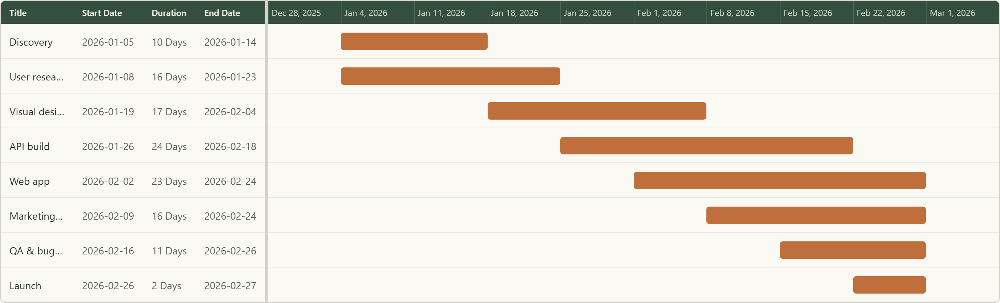
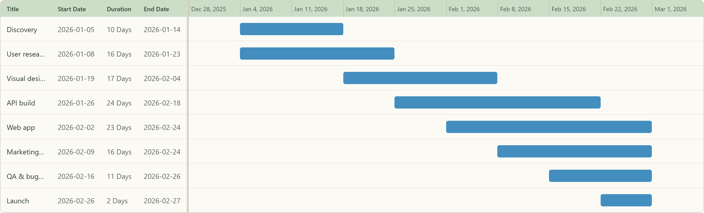
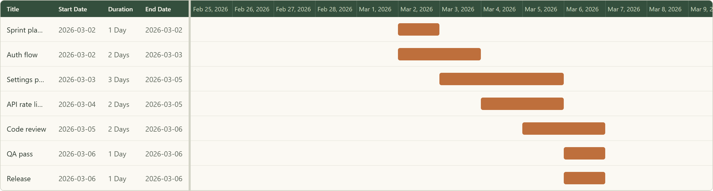
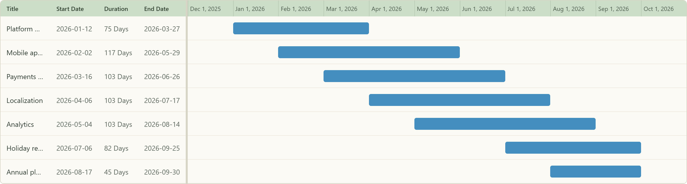
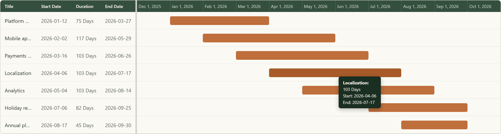
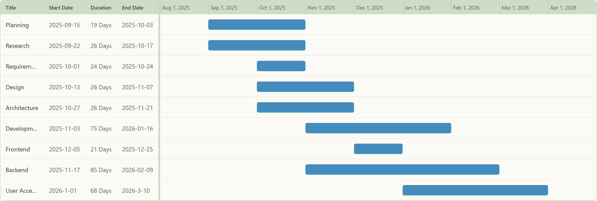

# Gantt Chart Component

A TypeScript + React Gantt chart. So pretty wow a chart that is = to a silly $500 per seat product



## Features

- **Three zoom levels.** Day, Week (weeks start on Sunday) and Month, switchable from the chart's toolbar.
- **Range from your data.** The timeline spans your earliest start to your latest end, padded by whole columns (5 days, 1 week or 1 month).
- **Resizable split pane.** Drag the divider between the table and the timeline (10–90%).
- **Hover tooltips** with title, duration, start and end that follow the cursor.
- **Row selection.** Click a row to highlight it in both the table and the timeline. Click it again to clear.
- **Automatic durations.** Inclusive day counts ("1 Day", "12 Days") are calculated from `startDate` / `endDate`.
- **Three themes** built on CSS custom properties: Forest (the default), Prairie and Mountain. Override any token to make your own.
- **Cool to use** exactly what I said

## Gallery

### Themes

Forest is the default theme (shown at the top). Here is the same launch plan in Prairie. A third theme, Mountain, is also built in; try it in the [live demo](https://darrenfisherlol.github.io/gantt-chart-component/).



### Time scales

Each sample dataset uses the zoom level that suits its time span.

**Day: a one-week sprint.** Short tasks get a column per day.



**Week: a two-month product launch.** Overlapping phases at a glance (see the screenshots above).

**Month: a three-quarter roadmap.** Long initiatives stay on one screen.



### Tooltip



### Edge cases

The original playground data: titles too long for the column are cut off with an ellipsis, and the project crosses the new year.



## Usage

```tsx
import { GanttChart, type GanttRow } from 'gantt-chart-component';
import 'gantt-chart-component/styles.css';

const tasks: GanttRow[] = [
  { title: 'Design', startDate: '2026-01-05', endDate: '2026-01-16' },
  { title: 'Build', startDate: '2026-01-12', endDate: '2026-02-06' },
  { title: 'Launch', startDate: '2026-02-09', endDate: '2026-02-09' },
];

// no userTheme -> Forest
export const ProjectTimeline = () => (
  <GanttChart items={tasks} userDateRange="Week" size="Large" />
);
```

> Not on npm yet... so ig git clone and copy & paste